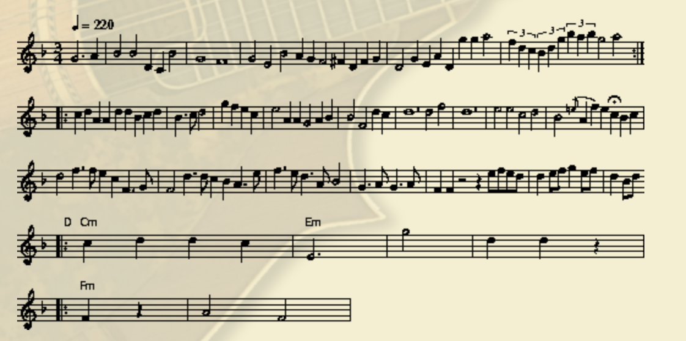
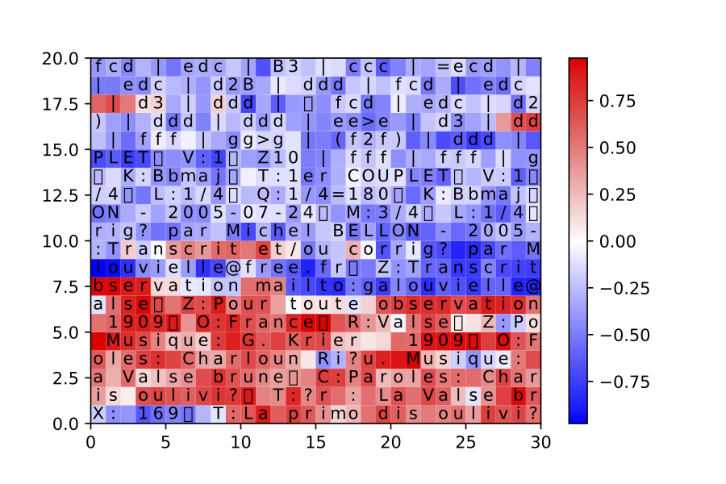

# MusicGenerator_LSTM

Python Version: 2.7.6  
Pytorch Version: 0.3.0

In this project, we use [LSTM](http://colah.github.io/posts/2015-08-Understanding-LSTMs/) to learn the pattern of the given music samples and generate decent musics. 

We use [ABC](https://en.wikipedia.org/wiki/ABC_notation) notation to represent the music, which is not a playable format. To convert music from ABC notation to a playable format (.midi in this case) online, go to [this website](http://mandolintab.net/abcconverter.php). 

In the given python code, you could change the hyperparameters such as type of the optimizer, batchsize and the size of the hidden layer by changing the comment lines in certain place. For the training step, usually it takes hours to get the decent results (i.e. learn the start, the end, the head and the body). Thus, change the training iteration larger. Correspondingly, at the generation stage, if the training is sufficient, you could not manually set the length of the generated music. Instead, detect the end sign of the generated music. At last, you could visualize the activation pattern of the LSTM network for given input music. Changing the number of the hidden layer which you want to inspect, you could visualize it in the end.  

For certain layer, the activation pattern is meaningful. The network could tell whether the input is the head or the body of the music in the ABC notation. 

Any further question, please let me know.
